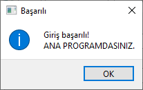

# EVRENSEL DESKTOP APP
Bu uygulama ile ... yapabilirsiniz..
 
## Projeyi çalıştırabilmek için 

aşağıdaki komutları cmd ekranına yada terminale yazınız.

### pip install pyqt6
### pip install mysql-connector-python veya python -m pip install mysql-connector-python

 

## Proje Login ekranı

Bu alanda kullanıcı adı ve şifresinizi doğru girmeniz gerekmektedir.

3 yanlış deneme sonunda program girişe izin vermeyerek kapanacaktır.

<h2>Proje Ana ekranı</h2>

